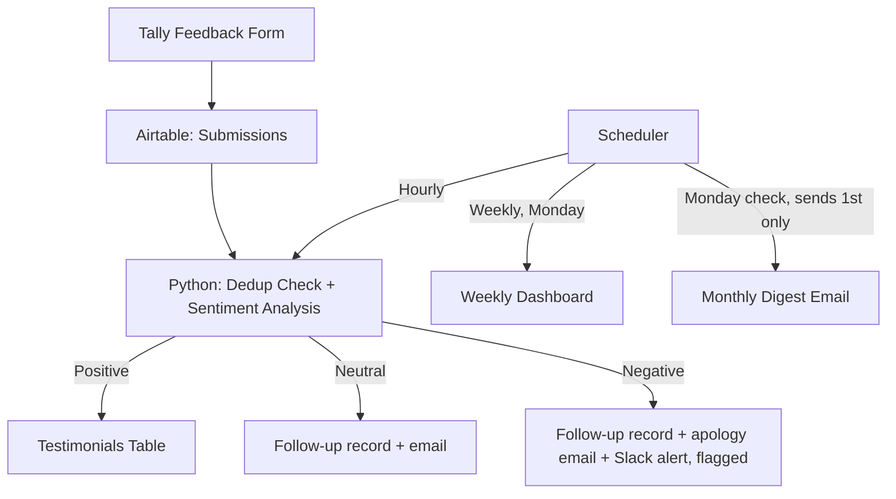

# Brew & Bloom: Automated Testimonial Collection System

An end-to-end automation that turns customer feedback into ready-to-use marketing testimonials, with zero manual work after a customer hits submit.

Built as a portfolio project (fictional business: a coffee and plant shop), demonstrating REST API integration, AI-in-the-loop decision-making, and scheduled automation in Python.

## The Problem

Small businesses collect feedback but rarely have a consistent system for acting on it: sorting the good from the bad, following up with unhappy customers, and turning glowing reviews into usable marketing copy. That process is usually manual, inconsistent, and easy to let slip.

## The Solution

A Python pipeline that:

1. Pulls every feedback submission from Airtable (fed by a Tally.so form) in one batched fetch
2. Flags duplicate submissions by email, checked in memory against that same fetch rather than a separate API call per record
3. Runs each new submission through an AI sentiment classifier (Positive / Neutral / Negative), which also drafts a ready-to-use testimonial for positive feedback
4. Routes each submission automatically:
   - **Positive** → copied into a Testimonials table
   - **Neutral** → logged as a follow-up, customer gets an email asking what could have been better
   - **Negative** → logged as a follow-up and flagged for review, customer gets an apology email
5. Runs on a schedule: the pipeline hourly, a weekly performance dashboard every Monday, and a monthly digest of top testimonials that checks every Monday but only actually sends on the first Monday of the month

## Architecture



## Project Structure

| File | Responsibility |
|---|---|
| `airtable_client.py` | Single source of truth for all Airtable access: URL building, pagination, record create/update, and retry-with-backoff on rate limits (429) and Airtable-side errors (5xx). Every other script imports from here instead of re-implementing it. |
| `process_submissions.py` | The hourly pipeline: dedup, sentiment analysis, routing, emails, Slack alerts. |
| `weekly_dashboard.py` | Builds/updates one Summary row per completed week. |
| `monthly_digest.py` | Emails the owner the top-rated testimonials from the previous calendar month. |
| `scheduler.py` | The long-running process that fires the three jobs above on their respective schedules. |

## Tech Stack

| Tool | Purpose |
|---|---|
| Tally.so | Feedback intake form |
| Airtable | Central database (Submissions, Testimonials, Follow-ups, Summary) |
| OpenAI API | Sentiment classification and testimonial drafting |
| Python `requests` | All REST API calls (Airtable, OpenAI), routed through a shared client with retry/backoff on rate limits and transient errors |
| Python `smtplib` | Follow-up and digest emails |
| Slack (incoming webhook) | Real-time alerts for negative feedback |
| Python `schedule` | Recurring job scheduling |

## Setup

1. Clone the repo and use `uv sync` to install dependencies from `pyproject.toml`
2. Create a `.env` file in the project root with:
   ```
   AIRTABLE_TOKEN=
   AIRTABLE_BASE_ID=
   OPENAI_API_KEY=
   SMTP_HOST=smtp.gmail.com
   SMTP_PORT=465
   SMTP_USER=
   SMTP_PASSWORD=
   FROM_EMAIL=
   OWNER_EMAIL=
   OWNER_NAME=
   SLACK_WEBHOOK_URL=
   ```
3. In Airtable, create a base with four tables: **Submissions**, **Testimonials**, **Follow-ups** (with a "Created At" field of type Created time), and **Summary** (see `weekly_dashboard.py` for the exact field list).
4. Connect your Tally form to the Submissions table (Tally's native Airtable integration).
5. Run the scheduler: `uv run scheduler.py`

## Results

This is a portfolio project built on a fictional business, so the numbers below are illustrative, but reflect the outcomes this kind of system is designed to produce:

- Response time to new feedback: from whenever someone checks manually, to within the hour
- 100% of submissions checked for duplicates before processing
- Zero manual sorting between positive, neutral, and negative feedback
- A ready-to-use testimonial library that builds itself over time

## What This Demonstrates

- REST API integration across multiple services (Airtable, OpenAI), with Bearer token authentication
- Pagination handling for datasets larger than a single API page
- AI-in-the-loop decision-making with a structured, parseable output format
- Conditional routing across three distinct outcomes
- Deduplication logic to prevent reprocessing the same customer twice, without a per-record API call
- Retry-with-backoff applied consistently across every external call (OpenAI and Airtable alike), not just the AI call — rate limits and transient 5xx errors get retried, malformed requests fail fast
- A single shared API client instead of duplicated request/pagination code across scripts
- Real-time team alerting (Slack webhook) triggered by a specific business condition
- Scheduled, unattended automation (hourly, weekly, and monthly jobs) via a single persistent process
